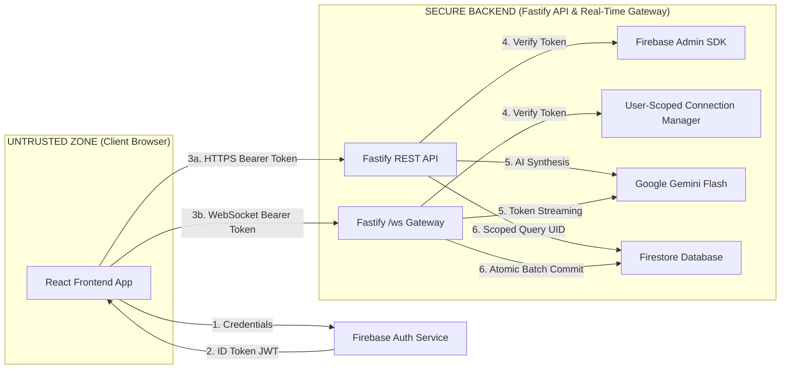

<div align="center">
  <a href="https://mindvault-39809.web.app">
    
  </a>
  
  # MindVault AI

  **A cryptographically secure, private second brain powered by Google Gemini & Real-Time WebSockets.**
  
  [](https://opensource.org/licenses/MIT)
  [](https://reactjs.org/)
  [](https://www.fastify.io/)
  [](https://github.com/fastify/fastify-websocket)
  [](https://firebase.google.com/)
  [](https://aistudio.google.com/)

  ### [🚀 Try the Live Demo](https://mindvault-39809.web.app/)

</div>

---

## 📖 Overview

**MindVault AI** is a highly secure, privacy-first personal intelligence platform. It acts as an AI-powered "second brain" that engages with you in reflective dialogue, automatically synthesizing your unstructured thoughts into actionable memories, recurring patterns, and structured goals. 

Unlike standard chat applications, MindVault is built on a **Non-Negotiable Security Constitution**, ensuring that your private reflections remain strictly yours. It utilizes a zero-trust browser architecture, rigid Firestore security rules, server-side token validation, and a high-performance **hybrid REST + WebSocket architecture** for real-time progressive AI streaming without compromising data isolation.

---

## ✨ Core Capabilities

- **🧠 Reflective AI Dialogue:** Chat with a finely-tuned Google Gemini model designed to prompt introspection and untangle complex thoughts.
- **⚡ Real-Time Token Streaming:** Low-latency progressive token-by-token generation (< 350ms time-to-first-token) with in-flight stream cancellation support.
- **🔄 Live Pipeline Telemetry:** Real-time multi-stage progress tracking during session synthesis (`Analyzing Context` → `Extracting Entities` → `Mapping Links` → `Finalizing`).
- **🕸️ Dynamic Memory Graph:** As you chat, the intelligence pipeline extracts core facts, decisions, and goals, wiring them into an interconnected knowledge graph.
- **🛡️ Multi-Layer Security:** End-to-end security architecture preventing XSS, Prompt Injection, and unauthorized cross-tenant data access.
- **📊 Intuitive Dashboard & Multi-Tab Sync:** A sleek, responsive dashboard built with Tailwind CSS and React to visualize your emerging thought patterns and recurring insights with live sync status.

---

## 🏛️ Architecture

MindVault AI utilizes a modern, server-authoritative hybrid architecture to ensure that the browser is never trusted with sensitive credentials while delivering instantaneous streaming responses.



### Hybrid Responsibilities
* **REST / HTTP**: Authoritative for authentication, CRUD, profile operations, graph retrieval, and cold cache persistence.
* **WebSocket (`/ws`)**: High-performance real-time layer for AI token streaming, session extraction progress events, stream abortion, and multi-tab state invalidation.

---

## 🛠️ Technology Stack

### Frontend (User Interface)
* **Framework:** React 18 with TypeScript
* **Build Tool:** Vite
* **Real-Time Client:** Custom singleton `WebSocketClient` with exponential backoff auto-reconnect, ping/pong heartbeat, and React Context integration
* **Styling:** Tailwind CSS + custom UI components
* **Routing:** React Router v6
* **Icons:** Lucide React

### Backend (Secure API & Real-Time Gateway)
* **Framework:** Fastify (High-performance Node.js web framework)
* **Language:** TypeScript
* **Real-Time Engine:** `@fastify/websocket` with strict UID tenant scoping, rate-limiting, and heartbeat monitoring
* **AI Provider:** Google Generative AI SDK (`gemini-3.5-flash-lite`, native `sendMessageStream`)
* **Authentication:** Firebase Admin SDK (JWT Validation)
* **Validation:** Zod (Strict schema enforcement for HTTP payloads and WebSocket frames)

### Infrastructure & Database
* **Serverless Compute:** Google Cloud Run (Containerized Fastify REST + WebSocket microservice)
* **Database:** Google Cloud Firestore (NoSQL Document Store)
* **Auth Provider:** Firebase Authentication
* **Security Rules:** Strict `firestore.rules` enforcement
* **Client Hosting:** Firebase Hosting (React Vite SPA)

---

## 🚀 Getting Started

### Prerequisites
* **Node.js**: `v18.x` or higher
* **npm**: `v9.x` or higher
* **Google Cloud SDK (`gcloud`)** & **Firebase CLI**
* **Google Cloud Project**: An active GCP/Firebase project with Authentication (Email/Password) and Firestore enabled.
* **Google AI Studio**: A valid Gemini API Key (`AIza...`).

### 1. Clone the Repository
```bash
git clone https://github.com/JAY4IGNITE/MindVault.git
cd MindVault
```

### 2. Configure the Environment
You will need to configure environment variables for both the frontend and backend.

**Frontend (`frontend/.env`):**
```env
VITE_FIREBASE_API_KEY=your_firebase_api_key
VITE_FIREBASE_AUTH_DOMAIN=your_project.firebaseapp.com
VITE_FIREBASE_PROJECT_ID=your_project_id
VITE_FIREBASE_STORAGE_BUCKET=your_project.firebasestorage.app
VITE_FIREBASE_MESSAGING_SENDER_ID=your_sender_id
VITE_FIREBASE_APP_ID=your_app_id
VITE_BACKEND_URL=https://<your-cloud-run-service-url>
```

**Backend (`backend/.env`):**
```env
PORT=8080
NODE_ENV=production
GOOGLE_CLOUD_PROJECT_ID=your_project_id
GEMINI_API_KEY=your_google_gemini_api_key
```

### 3. Run Locally (Development)

**Backend API & WebSocket Gateway:**
```bash
cd backend
npm install
npm run dev
```

**Frontend Application:**
```bash
cd frontend
npm install
npm run dev
```
Open [http://localhost:5173](http://localhost:5173) in your browser.

---

## ☁️ Deployment Guide (Google Cloud Run + Firebase)

### 1. Deploy Backend to Google Cloud Run
MindVault's backend is fully containerized and runs seamlessly on Google Cloud Run with WebSocket support and horizontal auto-scaling.

Deploy from the `backend/` directory with the mandatory **Cloud Run AI Challenge** label:
```bash
cd backend

# Build and deploy service to Google Cloud Run
gcloud run deploy mindvault-api \
  --source . \
  --region us-central1 \
  --allow-unauthenticated \
  --port 8080 \
  --set-labels dev-tutorial=cloud-run-ai-challenge \
  --set-env-vars NODE_ENV=production,GOOGLE_CLOUD_PROJECT_ID=mindvault-39809 \
  --set-secrets GEMINI_API_KEY=gemini-api-key:latest \
  --session-affinity
```

> **Note on WebSockets:** Cloud Run natively supports WebSockets out of the box. `--session-affinity` ensures that multi-tab sessions and streaming sockets remain routed smoothly.

### 2. Deploy Firestore Security Rules
Deploy the cryptographically isolated security rules to Firestore:
```bash
firebase deploy --only firestore:rules
```

### 3. Deploy Frontend to Firebase Hosting
```bash
cd frontend
npm run build
firebase deploy --only hosting
```

---

## 🛡️ Security Constitution & Firestore Security Rules

MindVault operates under a strict Threat Model. To ensure compliance, the codebase enforces the following:

1. **Zero Trust Browser:** No backend secrets, Gemini keys, or service accounts are bundled into the client application.
2. **Strict Tenant Scoping:** Firestore Security Rules and Fastify route/WebSocket handlers exclusively scope all database operations to `/users/{uid}/...` based on the cryptographically validated JWT.
3. **No Cross-User Event Leakage:** WebSockets map connections strictly by authenticated `uid`. Users can never subscribe to or receive another user's stream, notes, or analysis.
4. **Data Sanitization:** All user inputs are sanitized using DOMPurify before rendering to prevent Cross-Site Scripting (XSS).
5. **Prompt Injection Mitigation:** User input is strictly wrapped in `<user_provided_content>` tags, and the system prompt explicitly commands the AI to ignore any adversarial instructions found within those tags.

### Firestore Security Rules Breakdown
See the full implementation in [`firestore.rules`](./firestore.rules).
- **Default Deny:** Root-level documents are locked with `allow read, write: if false;`.
- **User Document Isolation (`/users/{uid}`):** Read/write strictly permitted only if `request.auth.uid == uid`.
- **Journal Subcollection (`/users/{uid}/journals/{journalId}`):** Write validation enforces non-empty content strings (1 - 50,000 chars) and protects `createdAt` from tampering.
- **Memory & Knowledge Graph Isolation (`/users/{uid}/memories`, `/users/{uid}/goals`, `/users/{uid}/decisions`, `/users/{uid}/knowledgeGraph`):** Users have exclusive access to their own extracted neural entities and graph edges; cross-tenant reads or writes are strictly blocked at the database engine level.

### Running Automated Test Suites

```bash
# 1. Backend REST & WebSocket Integration Tests (16/16 tests passing)
cd backend && npm run test:integration

# 2. Firestore Security Rules Isolation Tests
cd backend && npm run test:security

# 3. Frontend Unit & Sanitization Tests (9/9 tests passing)
cd frontend && npx vitest run
```

---

## 📄 License

This project is licensed under the MIT License - see the [LICENSE](LICENSE) file for details.

<div align="center">
  <sub>Built with security, intelligence, and privacy in mind.</sub>
</div>
