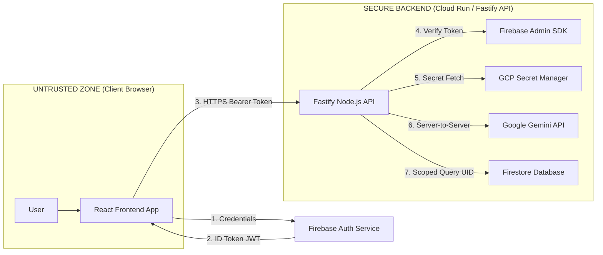

# MindVault AI

> A private, secure personal AI second brain built with a Non-Negotiable Security Constitution.

MindVault AI guarantees cryptographic tenant isolation, zero browser trust, AI system prompt guardrails, and sanitized input/output pipelines.

---

## Architecture Overview



---

## Monorepo Structure

```
mindvault-ai/
├── docs/                      # Architectural specs and security documentation
│   ├── SECURITY_CONSTITUTION.md
│   ├── THREAT_MODEL.md
│   └── API_SPEC.md
├── firestore.rules            # Production-grade tenant isolation security rules
├── firestore.indexes.json     # Firestore index declarations
├── firebase.json              # Emulator & hosting configuration
├── backend/                   # Fastify Node.js API with Firebase Admin & Gemini
└── frontend/                  # React + TypeScript + Vite + Tailwind CSS app
```

---

## Getting Started

### Prerequisites
- Node.js v20+ (Tested with v26)
- npm v10+
- (Optional for Emulators) Java JDK 17+ and Firebase CLI (`npm install -g firebase-tools`)

### 1. Root Setup
```bash
# Clone and enter directory
cd mindvault-ai
```

### 2. Backend Setup
```bash
cd backend
npm install
cp .env.example .env
# Start development server
npm run dev
```

### 3. Frontend Setup
```bash
cd frontend
npm install
cp .env.example .env
# Start Vite development server
npm run dev
```

---

## Running Multi-Layer Tests

- **Layer 1: Firestore Security Rules**:
  ```bash
  cd backend && npm test -- tests/security/firestore.rules.test.ts
  ```
- **Layer 2: Backend API Integration**:
  ```bash
  cd backend && npm test -- tests/integration/api.test.ts
  ```
- **Layer 3: Frontend Sanitization (XSS Prevention)**:
  ```bash
  cd frontend && npm run test
  ```

---

## Security Constitution Highlights

1. **Zero Trust Browser**: No credentials, master keys, or Gemini API keys are ever bundled or accessible to the browser.
2. **Server-Side Token Verification**: Every API request must pass through the `verifyAuth` middleware using the Firebase Admin SDK.
3. **Strict Tenant Scoping**: All database reads/writes are hard-scoped to `/users/{uid}/...`. Cross-UID access is blocked at both the API layer and the Firestore rule engine.
4. **Prompt Injection Protection**: All user input is wrapped in distinct delimiter boundaries `<user_provided_content>` before passing to Gemini.
